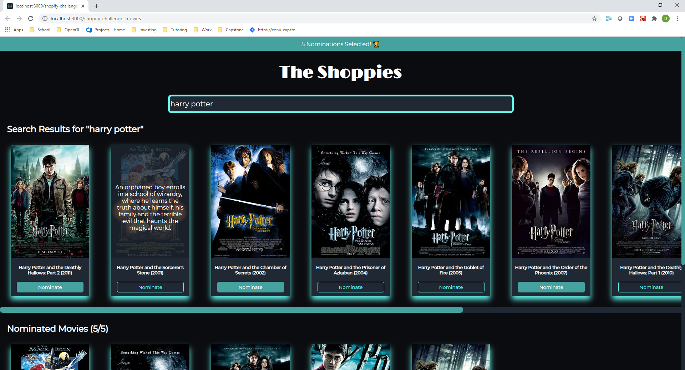

# The Shoppies: Movie Awards for Entrepreneurs

Shopify Front-End Developer Challenge (Summer 2021)

>_Shopify has branched out into movie award shows and we need your help. Please build us an app to help manage our movie nominations for the upcoming Shoppies._

## 🔗 Project Link: [The Shoppies](https://dlabbate.github.io/shopify-challenge-movies/)

## 📽️ The Challenge

We need a webpage that can search OMDB for movies, and allow the user to save their favourite films they feel should be up for nomination. When they've selected 5 nominees they should be notified they're finished.

We'd like a simple to use interface that makes it easy to:

- Search OMDB and display the results (movies only)
- Add a movie from the search results to our nomination list
- View the list of films already nominated
- Remove a nominee from the nomination list

## Technical Requirements

1. Search results should come from OMDB's API (free API key: http://www.omdbapi.com/apikey.aspx).
2. Each search result should list at least its title, year of release and a button to nominate that film.
3. Updates to the search terms should update the result list.
4. Movies in search results can be added and removed from the nomination list.
5. If a search result has already been nominated, disable its nominate button.
6. Display a banner when the user has 5 nominations.

## My Solution

  

## Extra Features

Some extra features I decided to implement include the following:

- Text overlay for each movie item which displays the movie plot (using OMDB API)
- Nominated movies are saved to local storage for persistence

## Technology Stack

- ReactJS
- JavaScript

